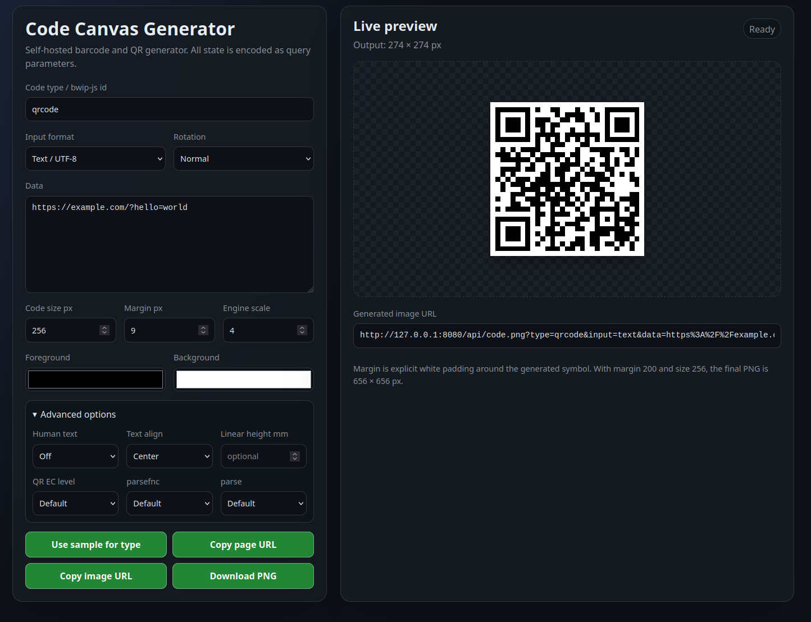

# Code Canvas Generator

Self-hosted barcode / QR generator with a browser canvas preview, query-parameter state, PNG download, and copyable image/page URLs.



## Run locally

```bash
npm install
npm start
```

Open `http://localhost:8080`.

## Run with Docker Compose

```bash
docker compose up --build
```

Open `http://localhost:8080`.

## Main query parameters

- `type`: bwip-js encoder id, for example `qrcode`, `azteccode`, `datamatrix`, `pdf417`, `code128`, `ean13`, `gs1-128`.
- `input`: `text`, `ascii`, `latin1`, `base64`, `base64url`, `hex`, `binary`, `urlencoded`, or `json`.
- `data`: payload in the selected input format.
- `size`: inner code area in pixels. Default: `256`.
- `margin`: explicit white padding around the code in pixels. Default: `0`.
- `scale`: bwip-js module render scale before final fitting. Default: `4`.
- `rotate`: `N`, `R`, `L`, or `I`.
- `fg`, `bg`: 6-digit hex colors.
- `includetext`: `true` or `false`.

The final PNG dimensions are `size + 2 * margin` square pixels.

## Example direct PNG URL

```text
http://localhost:8080/api/code.png?type=qrcode&input=text&data=https%3A%2F%2Fexample.com&size=256&margin=32&scale=4&rotate=N&fg=000000&bg=ffffff&includetext=false&textalign=center
```


